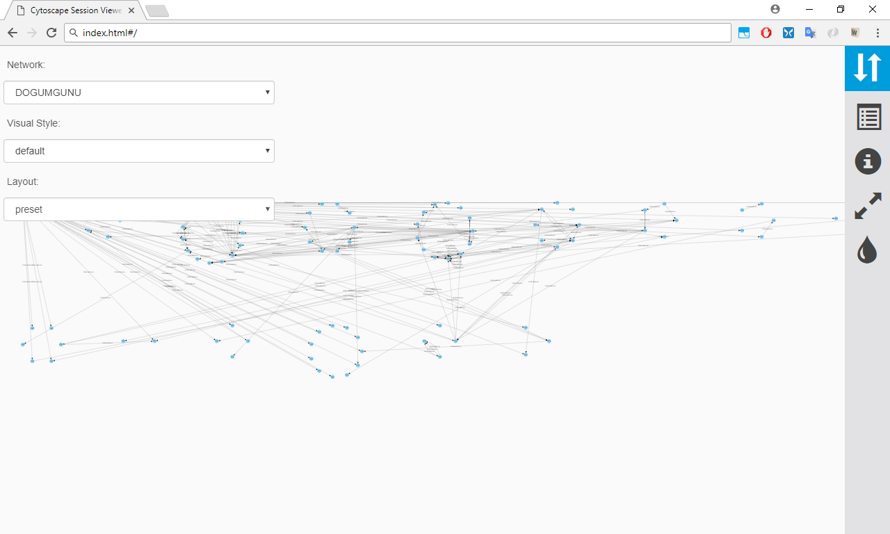

This folder is for visualization only. To open graphs, all files in this folder should be downloaded and index.html should be opened by any browser. 
There are three graphs. TAKDIR, TESEKKUR and DOGUMGUNU. All graphs are grouped by departmantID. The web page is generated by CytoScape 3.6.0 tool. It can be downloaded from http://www.cytoscape.org/. For neo4j connection cyNeo4j plugin is used. 

Here is a screenshot of the web page. From network dropbox, different graphs can be selected. From Visual Style dropbox, different visualization sytles can be selected. From Layout dropbox, different layout can be selected. As a defalult layout, employees are grouped by their departmentID
